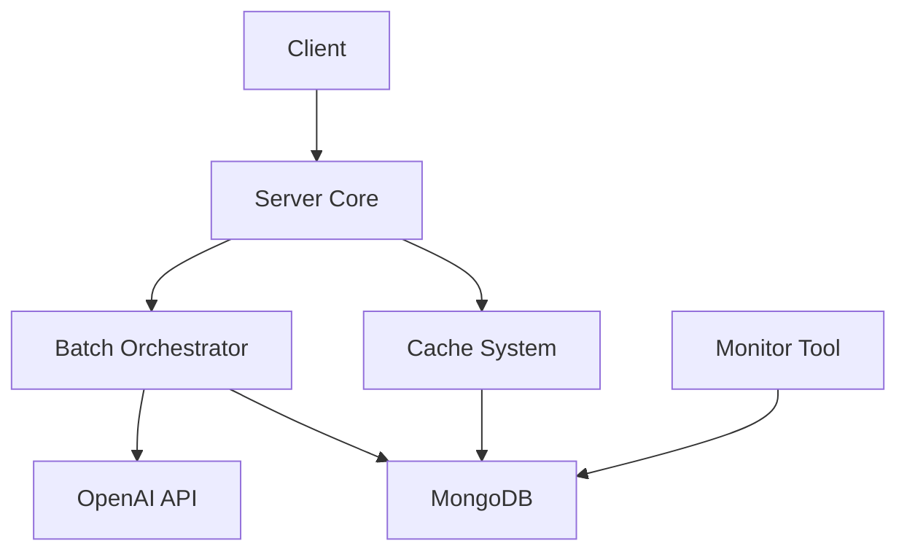

# Architecture
{: .no_toc }

## Table of contents
{: .no_toc .text-delta }

1. TOC
{:toc}

---

## Overview

Batch-GPT follows a modular architecture with clear separation of concerns:

```
server/
├── db/         # Database interactions
├── handlers/   # HTTP request handlers
├── logger/     # Custom logging
├── models/     # Data models
└── services/   # Business logic
    ├── batch/  # Batch processing
    ├── cache/  # Response caching
    ├── client/ # OpenAI client
    ├── config/ # Configuration
    └── utils/  # Common utilities
```

## Core Components

### Server Core
- Request routing and validation
- HTTP handlers
- Response formatting

### Batch Orchestrator
- Request collection
- Batch timing management
- Response distribution

### Cache System
- Request hashing
- Response storage
- Cache invalidation

### Monitor Tool
- Status visualization
- Batch tracking
- Progress reporting

### Database Layer
- MongoDB integration
- Persistence management
- Status tracking

## Data Flow

1. **Request Reception**
   - Request validation
   - Cache checking
   - Hash generation

2. **Batch Processing**
   - Request collection
   - Batch formation
   - OpenAI submission

3. **Response Handling**
   - Response collection
   - Cache updating
   - Client delivery

4. **Monitoring**
   - Status tracking
   - Progress updates
   - Error logging

## Component Interaction



## Design Decisions

### Batch Processing
- Configurable batch windows
- Hash-based deduplication
- Async/sync flexibility

### Caching Strategy
- MongoDB-based persistence
- Hash-based indexing
- Cross-session availability

### Monitoring
- Real-time updates
- Interactive interface
- Status aggregation
```
